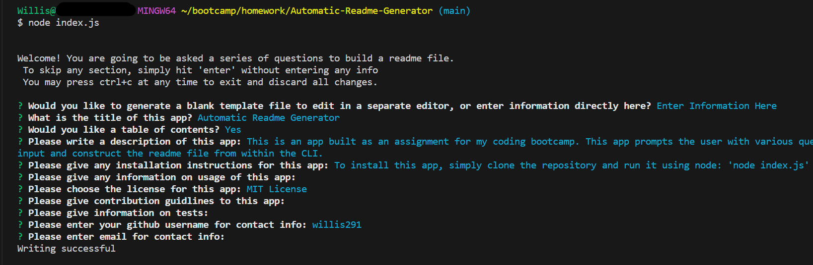

# Automatic Readme Generator

## Table of Contents

- [Description](#description)
- [Installation](#installation)
- [Usage](#usage)
- [Questions](#questions)
- [License](#license)

## Description

This is an app built as an assignment for my coding bootcamp. This app prompts the user with various questions and constructs a professional readme from their answers. For convenience, it has the option to either spit out a template quickly, or to integrate user input and construct the readme file from within the CLI. The readme you are currently reading was built in part by this generator

## Installation

To install this app, simply clone the repository and run it in a terminal using node: 'node index.js'

## Usage

To use this app, run it from a terminal using node. When you run the program, you will be prompted with a number of questions. To generate the file, simply fill in the requested information, and it will be inserted into a readme file. The readme file is generated after all of the questions have been answered or skipped. When finished, the file will be written to a folder called "output," in the root of the directory where you installed the app.

## Questions

You can contact me with questions in the following places: 

Github Profile: https://github.com/willis291 

## License

This repo and all of its contents operate under MIT License. For details, please view the LICENSE file in the repository or click the badge: 
